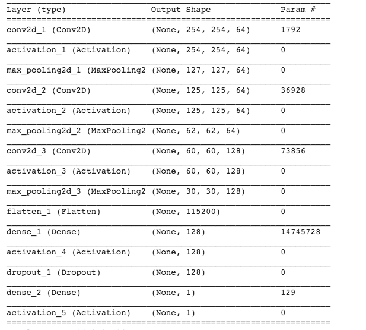

## Augmented-Colonoscpoy-Polyp-Detection

This project implements a CNN based polyp detector.

Dataset
=======
1. Extracted from ASU Mayo Polyp Databse: https://polyp.grand-challenge.org/AsuMayo/
2. Synthetic images generated using XD-Cycle GAN
3. Combination of above two.

Network
=======

# References:
1. https://github.com/muntisa/Colonoscopy-polyps-detection-with-CNNs

